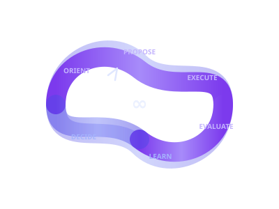

<div align="center">



```
 __  __  ___  ___ ___ _   _ ___
|  \/  |/ _ \| _ )_ _| | | / __|
| |\/| | (_) | _ \| || |_| \__ \
|_|  |_|\___/|___/___|\___/|___/
```

**High-performance Rust framework for autonomous ML experimentation.**

*One loop. One twist. Every pass learns.*

[](https://www.rust-lang.org/)
[]()
[]()
[]()

</div>

---

## What is Mobius?

Mobius is the unified framework that combines:

| Inspiration | What We Took | How Mobius Extends It |
|------------|-------------|---------------------|
| [Karpathy AutoResearch](https://github.com/karpathy/autoresearch) | Edit-run-eval-keep/revert loop | Gradient signals that *learn* which params help |
| [AIDE / WecoAI](https://github.com/WecoAI/aideml) | Tree-search over hypothesis space | Pluggable `Strategy` trait — swap search algorithms |
| [Meta REA](https://engineering.fb.com/2026/03/17/developer-tools/ranking-engineer-agent-rea-autonomous-ai-system-accelerating-meta-ads-ranking-innovation/) | Multi-day agent orchestration | Persistent state, budget guards, regression hooks |
| [NVIDIA NemoClaw](https://github.com/NVIDIA/NemoClaw) | Sandboxed agent execution | Compute backend abstraction (local, Modal, K8s) |
| [MCP Protocol](https://github.com/modelcontextprotocol/rust-sdk) | Tool integration standard | Native MCP server — any agent can drive experiments |

**The result:** A single `cargo install` gives you a CLI that runs autonomous ML experiments, evaluates results with multi-dimensional scoring, learns from each run, and stops when your targets are met or your budget runs out.

---

## Architecture

```
                    ┌─────────────────────────────────────────┐
                    │              mobius-cli                  │
                    │  init | evaluate | run | suggest | agent │
                    └──────────┬──────────────┬───────────────┘
                               │              │
                    ┌──────────▼──────┐  ┌────▼────────────┐
                    │  mobius-bench    │  │  mobius-claw     │
                    │  Matcher        │  │  AgentLoop       │
                    │  Evaluator      │  │  Strategy        │
                    │  DimensionScorer│  │  Hooks           │
                    │  (F1, Acc, MAE) │  │  LearningStore   │
                    └────────┬────────┘  └────────┬─────────┘
                             │                    │
                    ┌────────▼────────────────────▼─────────┐
                    │            mobius-core                 │
                    │  ExperimentStore  ComputeBackend       │
                    │  BudgetGuard     OutputParser          │
                    │  MobiusConfig    ErrorClassifier       │
                    │  Schema          Aggregation           │
                    └────────────────────┬──────────────────┘
                                        │
                    ┌───────────────────▼──────────────────┐
                    │           mobius-mcp                   │
                    │  MCP Server (10 tools, 3 resources)    │
                    │  Any agent can drive experiments       │
                    └───────────────────────────────────────┘
```

---

## Quick Start

```bash
# Clone and build
git clone https://github.com/lonexreb/mobius.git
cd mobius && cargo build --workspace

# Initialize a project
cargo run -- init          # Creates mobius.toml

# Run experiments
cargo run -- run --config '{"learning_rate": 0.01}'
cargo run -- suggest       # Gradient-guided suggestion
cargo run -- sweep --spec '{"lr": [0.01, 0.1], "batch": [16, 64]}'

# Evaluate
cargo run -- evaluate --predictions preds.json --ground-truth gt.json

# Autonomous loop (with strategy selection)
cargo run -- agent --budget 20.0 --strategy gradient_guided

# Monitor
cargo run -- status        # Best config + KPI gap
cargo run -- history       # Recent experiments
```

---

## The Agent Loop

Mobius agents run a 7-step cycle. Each iteration costs ~$1 on cloud GPUs:

```
   ┌──────────┐
   │  ORIENT  │ Load history, find best, check budget
   └────┬─────┘
        ▼
   ┌──────────┐
   │ RESEARCH │ Query external tools (Phase 3: MCP)
   └────┬─────┘
        ▼
   ┌──────────┐
   │ PROPOSE  │ Strategy.suggest() → next config
   └────┬─────┘
        ▼
   ┌──────────┐
   │ EXECUTE  │ Pre-hooks → ComputeBackend → parse output
   └────┬─────┘
        ▼
   ┌──────────┐
   │ EVALUATE │ Score results, run post-hooks
   └────┬─────┘
        ▼
   ┌──────────┐
   │  LEARN   │ Extract gradient signals → LearningStore
   └────┬─────┘
        ▼
   ┌──────────┐     ┌─────────────────────────┐
   │  DECIDE  │────►│ Continue | Switch | Stop │
   └──────────┘     └─────────────────────────┘
```

**Stop conditions:** targets met, budget exhausted, max iterations, plateau, or Ctrl-C.

---

## Configuration

Create `mobius.toml` (or run `mobius init`):

```toml
[project]
name = "my-ml-project"

[experiment]
budget_usd = 20.0
cost_per_run = 1.0

[experiment.targets]
f1 = 0.85
precision = 0.90

[experiment.sweep_space]
learning_rate = [0.001, 0.01, 0.1]
batch_size = [16, 32, 64]

[bench]
match_window = 6.0

[[bench.dimensions]]
name = "Detection"
weight = 0.50
scorer = "f1"

[[bench.dimensions]]
name = "Classification"
weight = 0.30
scorer = "accuracy"

[[bench.dimensions]]
name = "Timestamp"
weight = 0.20
scorer = "timestamp_mae"

[agent]
strategies = ["gradient_guided"]  # or "random", "grid"
plateau_window = 5
plateau_threshold = 0.02
```

---

## Gradient-Guided Learning

Unlike grid search or random search, Mobius **learns** from each experiment:

```
Experiment 1: learning_rate=0.001  →  f1=0.72
Experiment 2: learning_rate=0.01   →  f1=0.78   delta: +0.06
Experiment 3: learning_rate=0.1    →  f1=0.75   delta: -0.03

    ┌──────────────────────────────────────────┐
    │  ParamGradient: learning_rate             │
    │  Direction:     IncreaseHelps (to a point)│
    │  Best value:    0.01                      │
    │  Confidence:    Medium (3 observations)   │
    │  Avg delta:     +0.015                    │
    └──────────────────────────────────────────┘

→ Next suggestion: try learning_rate=0.01, explore untried batch_size
```

---

## Extensibility

Everything is a trait. Swap any component:

| Trait | Default Implementation | You Can Add |
|-------|----------------------|-------------|
| `ExperimentStore` | `JsonlStore` (JSONL files) | SQLite, Postgres, S3 |
| `ComputeBackend` | `SubprocessBackend` (local) | Async via `SyncAdapter`, parallel via `ParallelBackend` |
| `Matcher` | `GreedyTimestampMatcher` | Hungarian, multi-field |
| `DimensionScorer` | F1, Accuracy, MAE | Custom metrics |
| `Strategy` | `GradientGuidedTuning`, `RandomSearch`, `GridSearch` | Bayesian, tree search |
| `Hook` | Budget, Regression, Overfitting | Slack alerts, logging |

---

## Project Structure

```
mobius/
├── Cargo.toml                          # Workspace (edition 2024)
├── mobius.toml                         # Project config (user creates)
├── CLAUDE.md                           # Dev standards & architecture
├── FEATURES.md                         # Roadmap (Phase 1-4)
├── MEMORY.md                           # Session context
├── .mcp.json                           # MCP server config
├── .claude/                            # Claude Code integration
│   ├── settings.json                   # Hooks & permissions
│   ├── agents/                         # experiment-runner, code-reviewer
│   ├── commands/                       # /bench, /experiment
│   └── skills/                         # rust-patterns, ml-evaluation, agent-design
├── crates/
│   ├── mobius-core/                    # Types, config, storage, compute
│   ├── mobius-bench/                   # Evaluation engine
│   ├── mobius-claw/                    # Autonomous agent
│   ├── mobius-cli/                     # CLI binary
│   └── mobius-mcp/                     # MCP server (10 tools, 3 resources)
├── python/                             # Python SDK (Phase 4)
├── go/                                 # Go SDK (Phase 4)
└── examples/
    └── mobius.toml.example
```

---

## Testing

```bash
cargo test --workspace                                    # 82 tests
cargo clippy --workspace --all-targets -- -D warnings     # Zero warnings
cargo fmt --all --check                                   # Formatting
```

---

## Roadmap

| Phase | Status | What |
|-------|--------|------|
| **1: Core** | COMPLETE | Types, storage, config, compute, parsing, aggregation |
| **2: Agent** | COMPLETE | Evaluator, strategy, hooks, agent loop, 8 CLI commands |
| **3: MCP** | COMPLETE | MCP server with 10 tools, 3 resources, rmcp over stdio |
| **4: Production** | IN PROGRESS | Async backends, parallel sweeps, publishing |

## Documentation

- **[Usage Guide](docs/GUIDE.md)** -- Installation, configuration, running experiments, strategy selection
- **[MCP Setup](docs/MCP_SETUP.md)** -- Configuring Mobius as an MCP server for Claude Code and other clients
- **[Example Config](examples/mobius.toml.example)** -- Fully annotated `mobius.toml` template

---

## License

MIT OR Apache-2.0

---

<div align="center">
<sub>Built with Rust. Inspired by the ML research community. One loop to find them, one bench to score them, one claw to rule them all.</sub>
</div>
